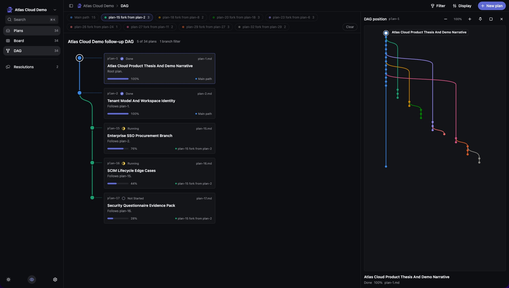
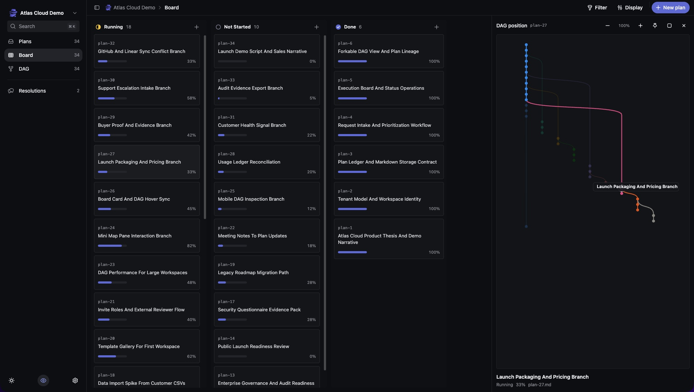
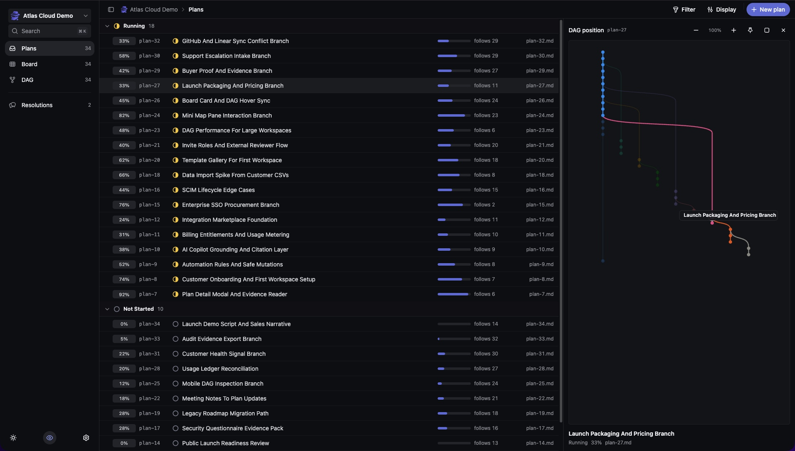

# Plansman

Plansman is a markdown-first planning system for humans and coding agents. It keeps plans as files, builds a forkable DAG from follow-up relationships, exposes the same workspace through CLI, REST, MCP, and web views, and records resolutions when planning threads conflict.



[Watch the demo video](https://x.com/ansonox/status/2074931553508216957/video/1)

## Implementation

This repository is the public Plansman application source. The product dashboard,
CLI, REST API, SDK, MCP server, and tests live together here. The landing page
and canonical public documentation are maintained separately in the `web`
repository.


For the implementation map, see [IMPLEMENTATION.md](IMPLEMENTATION.md).

## Installation

Install the latest CLI release:

```bash
curl -fsSL https://plansman.xyz/install.sh | sh
```

The installer downloads the matching binary from GitHub Releases and places it in `~/.local/bin`. Make sure that directory is on your `PATH`.

Manual downloads are available from the [latest GitHub release](https://github.com/Ansonhkg/plansman/releases/latest).

## Usage

Create or bind a workspace:

```bash
plansman init --workspace app
```

Inspect plans and their lineage:

```bash
plansman list
plansman dag
plansman get plan-1
```

Capture a rough idea with only a title, then return to it for discussion:

```bash
plansman idea "Add dependency-aware plan scheduling"
plansman idea list
plansman idea get B-1
plansman idea note B-1 --note "Dependencies should be explicit."
```

Ideas stay in a distinct inbox state inside the workspace backlog. When an
idea is developed, shape it into a complete PRD and goal contract:

```bash
plansman idea shape B-1 \
  --file dependency-scheduling.prd.md \
  --objective "Plans declare enforceable dependencies." \
  --requirements "Expose dependencies across CLI, SDK, REST, MCP, and web." \
  --forbidden "Do not infer dependencies only from plan numbering."

plansman idea promote B-1
```

Dismissed and promoted ideas remain visible in `plansman idea list`, preserving
their discussion history and outcome.

The shaped PRD stays in the existing idea record with its discussion and
explicit goal contract until promotion:

```bash
plansman idea shape B-1 \
  --file dependency-scheduling.prd.md \
  --objective "Plans declare enforceable dependencies." \
  --requirements "Expose dependency behavior across every Plansman surface." \
  --forbidden "Do not infer dependencies only from plan numbering."

plansman idea promote B-1
```

Use `--stdin` instead of `--file` when an agent is piping synthesized PRD
Markdown into the CLI. Shaped ideas can be revised, discussed, dismissed, or
promoted. Promotion copies the accepted PRD and stored goals into the plan
document itself, then links that self-contained plan back to the source idea.
Inbox ideas must be shaped before promotion.

The dashboard exposes the same workflow at `/ideas`, with inbox/history filters,
deep-linked idea detail, discussion notes, dismissal, and goal-complete promotion.

Create a self-contained PRD plan directly. `--file` must contain the canonical
PRD headings shown above; `--stdin` is also supported:

```bash
plansman new \
  --title "Goal-complete planning" \
  --file examples/self-contained-plan.prd.md \
  --objective "Every created plan states its intended outcome." \
  --requirements "Persist goals across CLI, SDK, REST, and MCP." \
  --forbidden "Do not leave placeholders or defer goal capture."
```

`plansman new` refuses a missing or incomplete PRD. Use
`plansman claim --title "..."` only when intentionally reserving a blank PRD
plan scaffold to fill later.

Open and decide a planning conflict:

```bash
plansman resolutions open \
  --title "Lifecycle naming" \
  --plans plan-9,plan-26 \
  --party agent-a \
  --conflict "Two branches use different deletion semantics."

plansman resolutions decide 1 \
  --status agreed \
  --decision "Use soft-delete with explicit restore."
```

## What It Does

- Stores plans as markdown files that are easy to diff, review, and move between tools.
- Builds a DAG from `follow_up` relationships so forks stay visible.
- Provides list, board, DAG, draft, and resolution views in the web app.
- Captures title-only ideas for later discussion and promotion into complete plans.
- Stores the full PRD and execution contract together in every accepted plan.
- Shapes mature ideas into durable PRDs, then copies them into promoted plans.
- Exposes the same plan system through CLI, REST, SDK, and MCP surfaces.
- Guards execution when open resolutions could affect the plan being changed.

## Screenshots

### Web DAG


### Board With DAG Context



### Plan List With DAG Context



## How It Works

Plansman separates the app repo from the plan data repo. By default, workspaces live in:

```text
~/Projects/plansman-workspaces
```

Each workspace has:

| Path | Role |
| --- | --- |
| `workspace.yaml` | Workspace name and enabled sections |
| `plans/` | Markdown plan files |
| `resolutions/` | Resolution records for conflicting planning threads |
| section folders | Optional draft or domain-specific markdown areas |

`plansman init` can also bind a source repository to a workspace by writing a small `plansman.yaml` file in that repo.

## Configuration

| Variable | Description |
| --- | --- |
| `PLANSMAN_ROOT` | Optional root directory for all Plansman workspaces. Defaults to `~/Projects/plansman-workspaces`. |
| `PLANSMAN_PORT` | REST API port. Defaults to `4000`. |
| `PLANSMAN_API_URL` | Optional Vite proxy target. Defaults to the matching Portless API route, or `http://127.0.0.1:4000` outside Portless. |

## Development

Install dependencies:

```bash
bun install
bun install --cwd apps/web
```

Start the REST API and web app through Portless:

```bash
bun run dev
```

The web app is available at `https://plansman.localhost` and the REST API at
`https://api.plansman.localhost`. Portless assigns the underlying ports and
adds matching prefixes when the repository is running from a Git worktree.
Its first run may ask to trust a local development certificate.

To run without the Portless proxy, use the fixed local ports (`3100` for web
and `4000` for the API):

```bash
bun run dev:direct
```

The web app uses HeroUI Pro (`@heroui-pro/react`). Installing or building `apps/web` requires a valid HeroUI Pro license and, in CI, a private `HEROUI_AUTH_TOKEN` secret. Do not commit HeroUI Pro package contents, auth tokens, or built web bundles.

Run checks:

```bash
bun run check
bun run check:web
bun run build:web
```

Run the local CLI from source:

```bash
bun ./plansman dag --workspace app
```

Build a standalone CLI binary:

```bash
bun run build:cli
```

## Release

GitHub Actions checks the core CLI on pushes and pull requests to `main`. Pushing a tag like `v0.1.0` builds native CLI artifacts for Linux, macOS, and Windows, then attaches them to a GitHub Release:

```bash
git tag v0.1.0
git push origin v0.1.0
```

## Demo Deployment

The marketing page embeds the live web demo from:

```text
https://plansman-demo.vercel.app/
```

Deploy `apps/web` as a separate Vercel project with:

| Setting | Value |
| --- | --- |
| Root directory | `apps/web` |
| Install command | `bun install --frozen-lockfile` |
| Build command | `VITE_PLANSMAN_DEMO=true bun run build` |
| Output directory | `dist` |

Set these Vercel environment variables:

| Variable | Description |
| --- | --- |
| `VITE_PLANSMAN_DEMO` | Set to `true` so the browser serves bundled mock data instead of calling a REST server. |
| `HEROUI_AUTH_TOKEN` | Private HeroUI Pro token required to install and build the web app. |

The Vercel project uses `apps/web/vercel.json` for the demo build command and SPA rewrites.

## Agent Setup

Copy this into your coding agent:

```text
Set up this repository locally. Install root and web dependencies with Bun, run the root checks, build the web app, build the standalone CLI binary, and report the local commands plus anything that still needs manual configuration.
```
